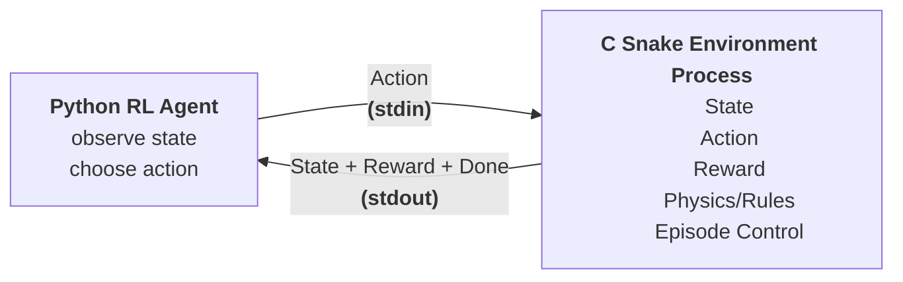

# Snake RL Environment

### The RL (Deep Q-Learning) implementation for this environment can be found here: [Snake AI](https://github.com/docot04/snake-ai)

A lightweight **Snake game environment** written entirely in **C** designed to be used as an external environment for **RL agents**.

The environment runs as a **standalone executable** and communicates with an RL agent through `stdin`/`stdout`, keeping the game simulation independent from the learning algorithm.



The environment also supports an **SDL2 graphical interface** for visualization and a **headless mode** for training, along with a **manual mode** to allow human inputs.

## Usage

The project requires `SDL2`, `SDL2_ttf`, `fonts-dejavu` along with `GCC`

For Debian/Ubuntu-based systems:

```
sudo apt install gcc libsdl2-dev libsdl2-ttf-dev fonts-dejavu
```

Compile with:

```
gcc snake.c main.c -o snake $(sdl2-config --cflags --libs) -lSDL2_ttf
```

Running Modes:

- `./snake manual` (to be played with human inputs)
- `./snake interface` (starts RL communication interface with SDL2 rendering)
- `./snake interface --headless` (starts RL communication interface without SDL2 rendering)

## Environment

- The environment uses a fixed `20 x 20` grid (each of size 20 x 20px when rendered using SDL2)
- The maximum possible snake length is: **GRID_WIDTH \* GRID_HEIGHT** which is `400`
- An episode begins with initial state:
  - length `2`
  - position `center of board`
  - direction `right`
  - score `0`
  - random food position
  - `done = false`

## Action Space

The agent controls the snake using these **relative actions** _(not absolute directions, preventing the agent from directly selecting an invalid opposite direction)_:

```
0 : ACTION_STRAIGHT
1 : ACTION_LEFT
2 : ACTION_RIGHT
```

The environment also supports two special commands in interface mode:

```
3 : RESET
4 : QUIT
```

## State Space

The environment exposes an **11 binary element state vector**, intentionally kept compact to be directly used as the observation for RL model.

```
0  : danger_straight
1  : danger_left
2  : danger_right
3  : food_up
4  : food_down
5  : food_left
6  : food_right
7  : direction_up
8  : direction_down
9  : direction_left
10 : direction_right
```

## Reward Function

The environment uses a simple reward function suitable for RL training. A small **survival penalty** encourages the agent to make progress rather than endlessly moving without eating food

```
Eat food        : +5.0
Normal Movement : -0.01
Death           : -10.0
```

## Communication Protocol

The Python process writes actions to `stdin` and the C environment writes observations to `stdout`, allowing the environment to run as a child process of the Python training program.

After every state transition, the environment sends a newline terminated and flushed output of the new state in this format:

```
OK state[0] state[1] ... state[10] reward score done
```

If the environment encounters an input or communication error, it sends:

```text
ERR
```

The environment is designed to be launched as a child process:

```python
import subprocess
env = subprocess.Popen(
    ["./snake", "interface", "--headless"],
    stdin=subprocess.PIPE,
    stdout=subprocess.PIPE,
    text=True,
    bufsize=1
)
```

The Python implementation can then:

1. Read an observation from `stdout` and parse the state
2. Pass the state to the RL model
3. Select an action
4. Write the action to `stdin` (0, 1, 2, 3, 4)
5. Read the resulting observation
6. Repeat until `done == 1`

## Project Structure

- [**snake.h**](./src/snake.h): environment definitions and public API
- [**snake.c**](./src/snake.c): Snake environment implementation
- [**main.c**](./src/main.c): executable interface and SDL handling

## Contributors

- [**Dixit**](https://github.com/docot04)
- [**Manjima**](https://github.com/thatmomfrnd)
